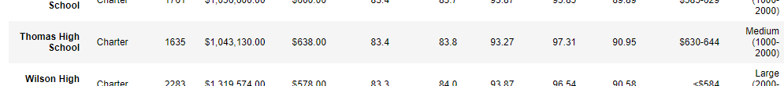
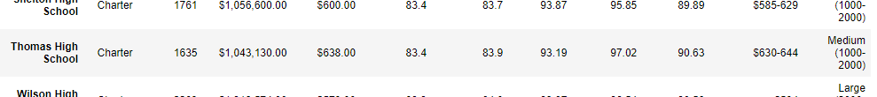
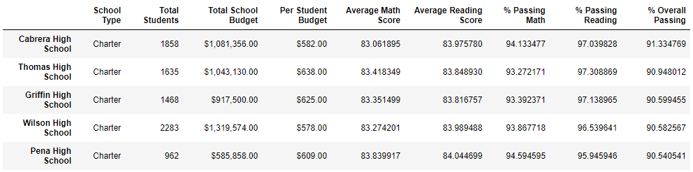
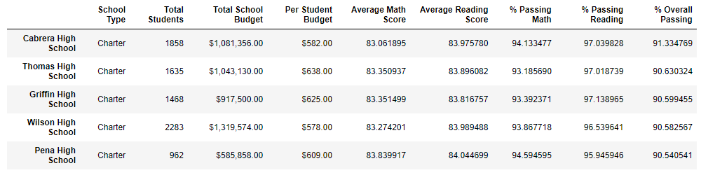
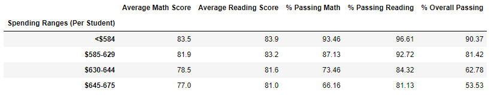
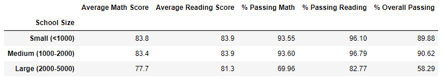
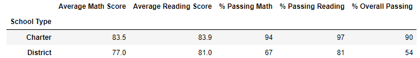

# School District Analysis

### Overview
This Analysis of data from a school district was processed to examine the possibility of falsified testing scores at one of the schools in this district, Thomas High School. To do so, I replaced the questionable scores with a placeholder that allowed me to recalculate and compare the analysis without the numbers being affected by those values. 

### Results
1. As you can see, the differences between district summaries is minimal. Without the data from the Thomas High 9th graders, the difference in the averages of overall test scores is less than 1%.
    - Before:
      - 
    - After
      - 
2. Clearly visible here is the evidence that replacing the ninth graders' scores made a negligible difference to the overall comparative ranking of Thomas High with other schools in the district.
    - Before:
      - 
    - After:
      - 
3. Replacing the ninth-grade scores at Thomas High has prompted the following results:
      - 
      - 
      - 

### Summary
In summary, and after reviewing the results from my analysis, I do not see statistically significant data that shows evidence of tampering. The differences in averages are present, but are less than 1% in all categories.
1. Average Reading Score stayed the same at 83.4
2. Average Math Score increased slightly, from 83.8 to 83.9
3. Percent Passing Reading decreased slightly, from 93.27% to 93.19%
4. Percent Passing Math had the greatest difference: a decrease from 97.31% to 97.02%
5. Percent Passing Overall decreased from 90.95% to 90.63%
